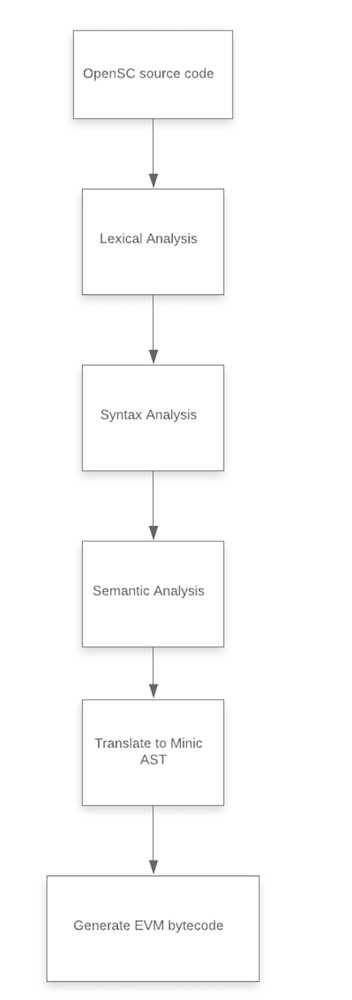

# OpenSC
A toy project of programming language for smart contract. 
This is final project for COMS W4115 programming language & translator @ Columbia.

## Introduction

[`OpenSC`](https://github.com/JackSnowWolf/OpenSC) 
is a functional programming language which has similar functionality 
compared to [`Scilla`](https://scilla.readthedocs.io/en/latest/) 
and [`Pact`](https://github.com/kadena-io/pact). 
It is statically typed and will support several features. 
It is a high-level language that will be primarily used to implement smart contracts,
 which are programs that provide protocol for handling account behavior in Ethereum.

Compared to other languages, we model contracts as some simple transition systems, 
with the transitions being pure functions of the contract state. These functions 
are expressed from one state to another state in a list of storage mutations.

Inspired by the `MiniC` language, part of the 
[`DeepSEA`](https://certik.io/blog/technology/an-introduction-to-deepsea) compiler, 
we aim to develop a language which allows interactive formal verification of 
smart contracts with security guarantees. From a specific input program, the 
compiler generates executable bytecode, as well as a model of the program that 
can be loaded into the [`Coq`](https://coq.inria.fr/)
proof assistant. Our eventual goal is that smart contracts like storage, 
auction and token can be written by `OpenSC`, and that these contracts 
can be compiled via the translator into binary codes that can be executed on `EVM`.

## Structure

### Translator Architecture



### Translate Details


### Code Structure


- [src/opensc.ml](src/opensc.ml) is the top-level program of the compiler
- A [src/Makefile](src/Makefile) is included to automate the compilation of the compiler


## Usage

### Environment Dependencies

- Install `ocaml`, which is what our translator is written in.
- Install `opam`, the ocaml package manager
- `opam install cryptokit`,  which is used in the `Minic` (IR code) generation phase of the compiler front-end for cryptographic hashing


### Synopsis

```bash
# at root directory of OpenSC
cd src && Make
./opensc.native [source.sc] [mode]
```

### Modes

- `ast`
    - generate raw AST and print its structure
- `sast`
    - generate SAST (semantically checked AST) and print its structure
- `minic`
    - generate `Minic` AST (the IR code) and print its structure
- `bytecode`
    - generate EVM bytecode and print it

### How to compile

```bash
# at root directory of OpenSC
cd src
# compile opensc
ocamlbuild -pkg cryptokit -I backend opensc.native
./opensc.native [source.sc] [mode]
# compile test.ml for printing ast
ocamlbuild test.native
./test.native < [source.sc]
# compile test2.ml for printing sast
ocamlbuild test2.native
./test2.native < [source.sc]
# compile test3.ml for printing Minic ast
ocamlbuild test3.native
./test3.native < [source.sc]
# compile test4.ml for printing bytecode
ocamlbuild test4.native
./test4.native < [source.sc]
```


### Reference Manual

Check our [Language Reference Manual](doc/OpenSC_Reference_Manual.pdf) for
 detailed usage


## Presentation

* Proposal: [proposal pdf](doc/PLT_Project_Proposal.pdf)
* Report: [report pdf](doc/PLT_Project_Report_OpenSC_A_Smart_Contract_Language.pdf)
* Language Reference Manual: [LRM](doc/OpenSC_Reference_Manual.pdf)


## Contribution

* __scanner:__ Linghan Kong, Chong Hu
* __parser:__ Linghan Kong, Chong Hu, Jun Sha
* __AST design:__ Linghan Kong, Ruibin Ma, Chong Hu
* __SAST design：__:  Linghan Kong, Ruibin Ma, Chong Hu
* __semantic analysis：__ Chong Hu, Linghan Kong, Ruibin Ma, Jun Sha
* __translate MiniC:__ Ruibin Ma, Linghan Kong, Chong Hu, Jun sha


## Acknowledgements

Thanks to Professor Ronghui Gu, the instructor of our course, who brought us to the PLT world and let us realize the charm of functional programming and formal verification, both of which are what our project is based on. 

Thanks to River Dillon Keefer and Amanda Liu, TAs of our course, who introduced the DeepSEA project to us and provided very inspiring and helpful ideas on the OpenSC language syntax among other project details. 

Thanks to Vilhelm Sjöberg, our project advisor, researcher at Yale and the primary creator of the DeepSEA project, who provided us with great information on everything about the DeepSEA project, and answered our many questions, which has been super helpful. 

## Contact

- Jun Sha `js5506`: [email](mailto:js5506@columbia.edu.com)
- Linghan Kong `lk2811`: [email](mailto:lk2811@columbia.edu)
- Ruibin Ma `rm3708`: [email](mailto:rm3708@columbia.edu)
- Rahul Sehrawat `rs3688`: [email](mailto:rs3688@columbia.edu)
- Chong Hu `ch3467`: [email](mailto:ch3467@columbia.edu)
